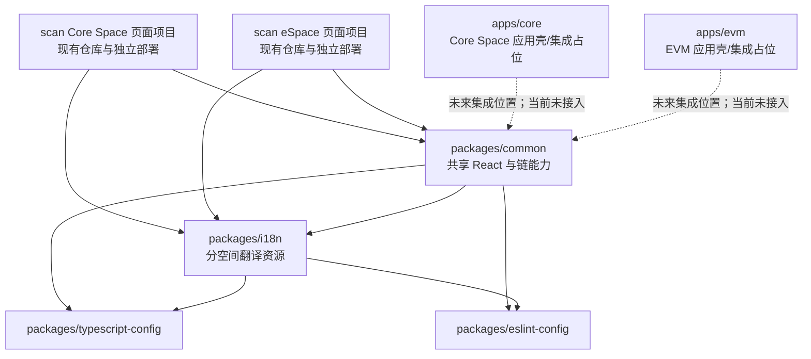
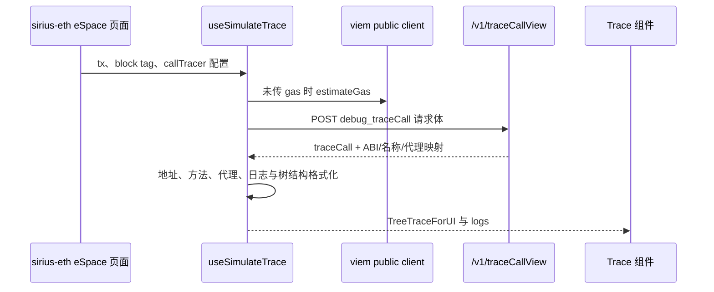

# Sirius Next 架构说明

本文面向后续开发和工程交接，描述仓库当前可从源码与配置确认的架构。
它记录的是“当前事实”，不是完整产品蓝图；后端实现、部署拓扑和线上运行环境
不在本文推断范围内。

项目背景和迁移状态见 [PROJECT_CONTEXT.md](./PROJECT_CONTEXT.md)，待确认事项与
建议执行顺序见 [TODO.md](./TODO.md)，三仓库路径和迁移规则见
[CROSS_REPO_CONTEXT.md](./CROSS_REPO_CONTEXT.md)。

## 1. 项目定位与当前阶段

`sirius-next` 是 ConfluxScan 下一代前端的 pnpm monorepo。当前阶段的主要目标
是沉淀 Core Space 与 EVM 共用的组件、链上数据处理和翻译资源，并让现有 scan
项目逐步替换旧实现；不是立即把 scan 的全部页面和部署迁入本仓库。

仓库目前处于 package-first、scan-first 的迁移阶段：成熟能力主要位于
`packages/common` 和 `packages/i18n`；Core Space 和 eSpace 仍在各自的 scan
项目中维护页面和独立部署。迁移工作从 scan 旧代码中抽取通用能力，放入 next
包后再由 scan 替换引用，重复此过程，直到 scan 主要剩余页面编排和 Space 特有
逻辑，之后才评估页面部署的整体迁移。`apps/core`、`apps/evm` 仍是 Vite 示例
壳，不是当前生产页面迁移的宿主。

## 2. Monorepo 总览



工作区由 `pnpm-workspace.yaml` 收纳 `apps/*` 和 `packages/*`。根目录要求
Node.js 18 以上、pnpm 9.5，并由 Turborepo 编排：

- `build` 先构建依赖包，缓存 `dist/**`。
- `lint` 先检查依赖包。
- `dev` 是不缓存的常驻任务。
- `.env.*local` 被声明为 Turbo 全局依赖；密钥只能放在未跟踪的本地环境文件。

增量迁移的实际依赖方向是：现有 scan 页面项目消费本仓库的可发布包，完成一项
能力替换后继续由 scan 项目独立构建、验证和部署。开发阶段可按 README 使用软
链接；发布阶段应遵循公共包的 Changeset 和版本管理约定。新 app 的完整路由和
部署不属于当前阶段的前置条件。

当前本地联合工作区中的外部消费者为 `/Users/mac/Desktop/code/sirius` 和
`/Users/mac/Desktop/code/sirius-eth`。它们不是本 monorepo 的 workspace 成员，
但在迁移任务中可以作为可读参考和独立验证对象；详细的仓库职责、默认读写边界
和接手顺序见 [CROSS_REPO_CONTEXT.md](./CROSS_REPO_CONTEXT.md)。

### 2.1 应用目录

- `apps/core`：Core Space 的 Vite + React 18 + TypeScript 应用壳和集成占位，
  当前不承载 scan 生产页面。
- `apps/evm`：EVM 界面的同构应用壳，目前示例标题为 eSpace，当前不承载 scan
  生产页面。
- 两个应用当前只有 React/Vite 示例代码，没有路由、环境初始化、i18n 初始化、
  请求接入或完整产品页面；不应把建立这些页面作为当前公共能力迁移的前置任务。
- 应用构建均为 `tsc && vite build`，样式入口使用 Tailwind CSS 3。

### 2.2 公共包

- `packages/common`：可发布包 `@cfxjs/sirius-next-common`，承载共享组件、
  hooks、请求、状态、ABI、地址与交易解码、图片和样式。
- `packages/i18n`：可发布包 `@cfxjs/sirius-next-i18n`，按 `cspace` 与
  `evm/{base,espace,bspace}` 组织英文、简体中文资源，并提供翻译资源类型。
- `packages/eslint-config`：仓库共享 ESLint 预设，仅作开发工具。
- `packages/typescript-config`：严格模式、Bundler module resolution 等共享
  TypeScript 预设。

## 3. 构建、样式与测试

`packages/common` 通过 tsup 递归扫描 `src`，为除图片、测试以外的源码文件
生成逐文件 ESM 入口、类型声明和 source map，目标为 ES2020。React、ReactDOM、
i18next、react-i18next 和 react-router-dom 保持 external，部分 UI 和链 SDK 被打入
产物，PNG/SVG 作为资源复制。
当前没有单一 barrel 入口或 `exports` 映射；既有文档按
`@cfxjs/sirius-next-common/dist/...` 深路径消费，因此新增或移动文件可能影响
包的公开入口。

共享组件样式由 UnoCSS 扫描 `src/components/**/*.tsx`，输出
`dist/uno.css`；应用自身使用 Tailwind。应用接入公共组件时，宿主必须明确加载
公共 CSS，并维护 UnoCSS 主题所引用的 CSS 变量，不能假定应用的 Tailwind 会
生成公共包类名。

测试框架是 Vitest 3.2.3 + jsdom，测试与实现相邻，命名为 `*.test.ts(x)`；每个有
测试的 package 使用自己的 `vitest.config.ts`，根目录通过 Turbo 分发 `test` 和
`test:coverage`，避免不同 package 的 `src` alias 相互覆盖。根目录不应重新引入
指向 `common/src` 的全局 Vitest alias。Jest 配置及 common 的直接 Jest 测试依赖已
删除。当前测试主要覆盖 `packages/common` 的地址、请求、缓存、RPC、SDK、store、
表格、ABI、Trace 与 calldata 等逻辑；两个应用尚无页面级或端到端测试。常用命令：

```bash
pnpm build
pnpm lint
pnpm test
pnpm test:coverage
pnpm --filter @cfxjs/sirius-next-common exec vitest run
pnpm --filter @cfxjs/sirius-next-common exec vitest run src/utils/request.test.ts src/utils/pubsub.test.ts
pnpm test:consumers
```

## 4. `packages/common` 内部分层

`common` 不是严格按层强制隔离，但可按职责理解为：

1. **资源与领域基础**：`abis/`、`images/`、`utils/types.ts`、地址、数值、
   calldata、ABI 等纯函数。
2. **基础设施**：`utils/request.ts` 处理 HTTP；`rpcRequest.ts` 兼容
   `window.CFX`；`sdk.ts` 用 viem/cive 封装 EVM/Core 公共客户端；缓存和
   pub/sub 分别承担请求去重及错误通知。
3. **状态适配**：`store/` 使用 Zustand 保存环境配置、翻译键对象、网络与
   合约全局数据、ENS、名称标签缓存、Gas 价格和高亮状态。
4. **数据 hooks**：`utils/hooks/` 以 SWR/SWR Immutable 组合请求、缓存和领域
   格式化，例如表格分页、合约详情、地址名称、ABI、交易 Trace 和模拟 Trace。
5. **视图组件**：`components/` 消费 hooks/store，提供地址、交易 Action、
   Input/Output Data、Trace、ABI、表格、图表和通用 UI。

推荐依赖方向为：

```text
scan 页面 -> common 组件 / hooks -> request、SDK、store -> 外部接口或链 RPC
scan 启动 -> i18n 资源 + 环境/全局配置 -> common store -> 组件与工具
```

包内已有少量工具直接读取全局 store，因此它不是无状态组件库。消费方必须先
完成运行时初始化，再渲染依赖这些值的组件。

基础设施的几个稳定契约需要特别注意：`fetchWithCache` 使用内存 Map，按显式 key
加参数或生成器生成 key，按 `maxAge` 失效；缓存的 rejected Promise 会被移除，下一次
调用才能重试。`rpcRequest` 将 `namespace_method` 分派到 `window.CFX`，缺少接口或
调用失败时发布 RPC 错误后继续抛出。`useEnv`/`useI18n`/`useGlobalData` 的顶层设置
是替换语义，而 ENS、nametag 和 contract cache 是嵌套 map 合并语义。

## 5. Core 与 EVM 的边界

公共 API 通常以 `space: 'core' | 'evm'` 作为分派键，但链差异不能被抹平：

| 关注点             | Core                                       | EVM                                         |
| ------------------ | ------------------------------------------ | ------------------------------------------- |
| 地址展示           | Base32 为主，并保留 pocket、内置合约等语义 | Hex/checksum，含 EOA with code              |
| SDK                | cive，估算 Gas 与存储抵押                  | viem，标准 EVM Gas 估算                     |
| 地址组件           | `CoreAddressContainer`                     | `EVMAddressContainer`                       |
| Transaction Action | Core 专用格式化                            | EVM 专用格式化及临时地址 key 转换           |
| 已上链交易 Trace   | `useTxTrace` 支持                          | `useTxTrace` 支持，另处理 delegated address |
| Simulate Trace     | 当前不支持                                 | `useSimulateTrace` 当前只允许 EVM           |

共享代码应把格式化和展示协议统一在 `Space` 分支之后，而不是在 scan 页面中
散落地址转换或 SDK 判断。增量迁移阶段，链专属页面、路由和业务编排留在各自
的 scan 项目；只有两端确实共用的能力才下沉到 `packages/common`。

## 6. 典型数据流

### 6.1 环境与 i18n

消费方（当前主要是 scan 页面项目）负责选择当前网络和语言资源，并把环境写入
`useEnv`、翻译键对象写入 `useI18n`、网络/合约等运行数据写入 `useGlobalData`。
组件同时使用
`react-i18next` 的 `t()` 和 common store 中的键对象；因此宿主还需初始化
i18next，二者必须保持同一资源空间。

环境中已被公共包使用的字段包括 `ENV_NETWORK_ID`、`ENV_RPC_SERVER`、
`ENV_OPEN_API_HOST` 和可选的 `ENV_WALLET_CONFIG`。具体配置加载协议尚未在新
应用中实现。

### 6.2 HTTP 与链请求

```text
组件 -> SWR hook -> fetchWithPrefix -> 相对路径 /v1/*
                              \-> fetchWithOpenApi -> ENV_OPEN_API_HOST/*
```

请求层统一处理 60 秒超时、HTTP 状态、Core 风格 `code/data` 与
EVM 风格 `status/result` 响应，并通过 pub/sub 发布错误通知。普通请求超时发布
一次 code `20002` 并拒绝 `Request timeout`；直接 AbortError 发布 code `20003`，
`showErrorMessage: false` 时不发布通知；HEAD 请求继续返回兼容的 408/599 Response。
链调用由
`sdk.ts` 根据 `space` 创建并缓存 cive/viem public client；另有少量旧式 RPC
通过页面注入的 `window.CFX` 调用。页面不应重复实现这些兼容逻辑。

`pubsub` 是 common 内的单例通知总线，以 `Map<EventName, Set<Subscription>>`
保存订阅。每次订阅使用独立、稳定的订阅记录，发布时遍历快照，因此回调自取消不会
跳过后续订阅；同一 callback 的多次订阅可分别移除，取消函数幂等，事件名不受
`Object.prototype` 属性影响。修改这套行为必须同时考虑 `publishRequestError` 和
scan 的全局通知消费者。

`sdk.ts` 按 `space` 缓存一个 public client：EVM 使用 viem 的 `estimateGas`，Core
使用 cive 的 `estimateGasAndCollateral` 并返回 `gasLimit`；两者都把字符串 value
转为 bigint，优先使用 `ENV_WALLET_CONFIG`，否则从环境 RPC 配置构造 fallback chain。
切换网络或修改这些初始化字段时，必须明确 client cache 的生命周期，不能只改 store
而假设已有 client 会自动刷新。

### 6.3 Simulate Trace



`useSimulateTrace` 已由 `sirius-eth` 的
`src/app/containers/SimulatePage/index.tsx` 实际消费，当前接入范围是 EVM
Simulate 页面；Core Space scan 和 `apps/*` 尚未接入该能力。日志索引当前由
前端遍历顺序生成，源码仍标记为应改用接口返回的真实索引并排序。实现排序前，
必须先确认 `/v1/traceCallView` 对嵌套 call、缺失索引和同索引日志的语义。

### 6.4 Calldata URL

`utils/calldataUrl.ts` 已实现 Hex、`b1.` Base64URL、`d1.` raw DEFLATE 的
严格编解码和 1 MiB 安全上限。`sirius-eth` 已在 Simulate 页面读取并解码
URL calldata，并在 Contract ABI 方法入口生成 calldata URL。正确页面顺序应是：
读取唯一 `data` 参数，调用
`decodeCalldataFromUrl`，失败时展示错误并停止，成功后才进行 ABI 解码和
Simulate RPC。生成分享链接时调用 `encodeCalldataForUrl`，再用标准 `URL` API
写入参数。Core Space scan 和 `apps/*` 目前尚未接入该能力。完整协议与接入约束
见 [`packages/common/docs/calldata-url.md`](../packages/common/docs/calldata-url.md)。

## 7. 扩展准则

- 增量迁移阶段，scan 专属路由、页面和业务状态继续放在各自的 scan 项目；不
  要为了使用公共包而提前把页面搬进 `apps/*`。
- `apps/core`、`apps/evm` 当前只作为应用壳或集成验证位置；只有在整体页面迁移
  阶段明确启动后，才将其视为生产页面承载目标。
- 跨空间复用代码进入 `common` 前，应以明确的 `space` 参数或链适配器隔离差异。
- 通用算法尽量保持纯函数；需要环境、翻译或网络状态时显式记录初始化前置条件。
- 新请求应复用请求层和 SWR key 约定；不要在组件内自行拼接 Open API host、
  重复解析响应或绕过统一错误通道。
- 不要把 timeout 触发的内部 AbortError 当成第二个用户错误，也不要改变现有 20002、
  20003 或 HEAD 408/599 语义；修改 pubsub 时保留单例总线和取消订阅契约。
- 地址在进入展示或 map lookup 边界时统一规范化，避免 Base32、原始 Hex 和
  checksum Hex 混作 key。
- 公共组件改动要同步考虑 UnoCSS 产物、深路径入口、类型声明和 scan 旧项目
  消费者的兼容性。
- 解析、格式化、请求及 URL 协议变更必须补相邻单元测试；替换 scan 旧逻辑时
  还要补 scan 侧的行为、构建和部署验证。
- 修改可发布 package 时按仓库约定创建 Changeset；不要把密钥或环境专属
  endpoint 写入仓库。

## 8. 已知架构缺口

1. 两个 app 仍为脚手架，缺少真实路由、布局、配置、i18n、请求和页面集成；
   这属于后续整体页面迁移的缺口，不是当前公共能力替换的阻塞项。
2. 当前迁移依赖 scan 旧仓库消费公共包，公共包版本、软链接/发布包策略和跨仓库
   验证流程仍需标准化。
3. 环境 store 使用 `any`，启动协议未类型化；`NETWORK_ID` 在模块加载时读取并
   固化，SDK client 也按 space 缓存，运行时切网的生命周期需要统一设计。
4. 翻译同时依赖 i18next 与 Zustand 键对象，初始化顺序和资源一致性没有应用层
   契约或测试保障。
5. `common` 以深路径作为公开 API，缺少清晰的 package exports 和稳定性分级。
6. 应用 Tailwind 与公共包 UnoCSS 并存，公共 CSS/主题变量的宿主接入尚无模板。
7. `react-router-dom@5` 已被 common hooks 使用，但新 apps 尚未建立路由层。
8. Simulate Trace 仅支持 EVM；`sirius-eth` 已接入请求、页面展示和 calldata
   URL，Core Space scan 与 `apps/*` 尚未接入，日志真实索引仍待补齐。
9. EVM Transaction Action 仍为 API 地址格式做临时 map key 转换。
10. 测试集中在公共包；apps 和 i18n 尚未提供自己的测试脚本/配置，且仍缺少公共
    包与 scan 消费方之间的集成测试、scan 侧回归测试和端到端验证。未来其他 package
    增加测试时必须沿用 package-local Vitest 配置和脚本。
11. `common` 已将 React、Router 和 i18n 等上下文依赖声明为 peer dependency，
    并增加了 Core/EVM 打包 consumer smoke test；两个 scan 仍需升级到包含该
    修复的发布版本后完成真实消费验证。当前 smoke test 不覆盖 strict peer semver
    安装失败路径，也不替代 scan 页面/构建/部署验证。

后续迁移宜先从 scan 旧代码中选择一个边界清晰、复用价值高且 Space 差异较小
的公共模块，完成“抽取/重构 → common 测试 → scan 替换 → scan 构建与部署验证”
的闭环，再将流程固化为后续模块的迁移模板。只有在公共逻辑大部分替换完成后，
才重新评估 `apps/core`、`apps/evm` 的页面承载和整体部署迁移。
